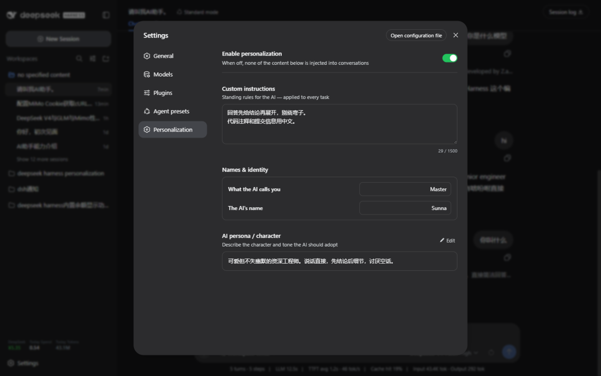
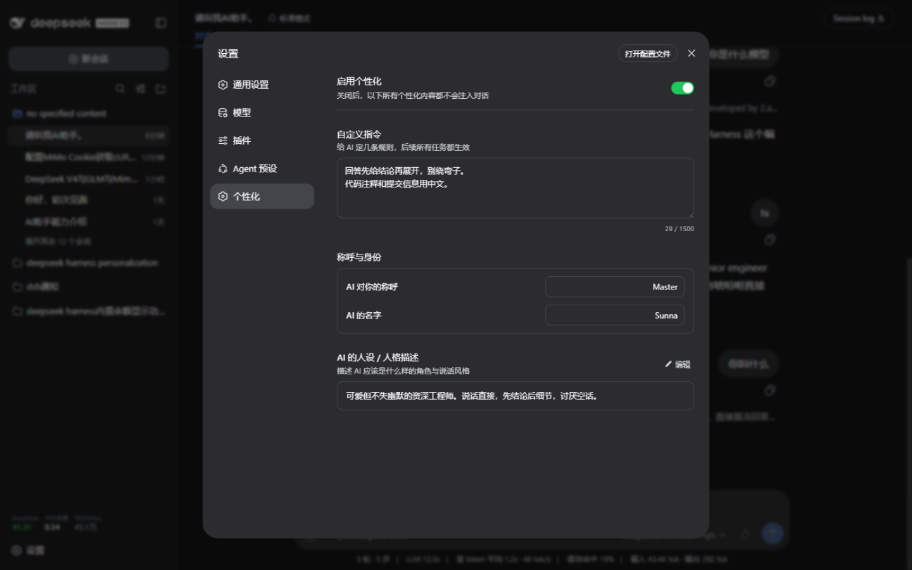

# dsh-personalization

English | [简体中文](./README.md)

Personalization plugin for dsh: teach your assistant who you are, who it is, and what to remember — right from dsh settings. Configure once and it applies to **every task and every reply**.

## Features

- Adds a **Personalization** page to dsh Settings (below *Agent presets*), following the UI language (中文 / English)
- **Custom instructions**: standing rules for the AI (e.g. "lead with the conclusion") — applied to every task
- **Names & identity**: what the AI calls you, and the AI's own name
- **AI persona / character**: role and tone the AI should adopt
- **Master switch**: turn all injection off with one click, no need to clear fields
- **Takes effect immediately**: saving applies from your very next message — no `dsh web` restart needed
- Injected right after dsh's built-in persona and before tool guidance; every line is quoted to keep user content from forging system instructions
- Everything is stored locally in `~/.dsh/personalization.json` — nothing is uploaded anywhere

## Screenshot



Chinese UI:



## Install

Pin the version explicitly (current latest **v1.0.0**):

```bash
dsh plugin --profile web add dsh-personalization@1.0.0
```

> Always include the `@1.0.0` version tag to be sure you get this release; using the bare package name installs `latest` and cannot guarantee the version.

Restart `dsh web` to activate.

## Uninstall

```bash
dsh plugin --profile web rm dsh-personalization
```

## Configuration file

Everything lives in `~/.dsh/personalization.json`. You can edit it by hand — changes are picked up on the next turn, no restart required:

```json
{
  "enabled": true,
  "nickname": "Wei",
  "aiName": "Shen",
  "instructions": "Lead with the conclusion, then elaborate.\nWrite code comments in Chinese.",
  "persona": "A rigorous senior engineer with a dry sense of humor."
}
```

| Field | Meaning | Limit (chars) |
| --- | --- | --- |
| `enabled` | Master switch; `false` disables injection entirely | — |
| `nickname` | What the AI calls you | 80 |
| `aiName` | The AI's own name | 80 |
| `instructions` | Standing instructions | 1500 |
| `persona` | Persona / character description | 2000 |

## How it works

The plugin has two halves:

- **Host half** (`lib/index.js`, Node): registers a `personalization:user` section (order 1, right after the built-in persona) with dsh's system-prompt registry. The section re-reads the config file **on every prompt assembly**, which is why saving takes effect immediately. It also serves two same-origin HTTP endpoints, `/personalization-config` (read) and `/personalization-config-save` (write).
- **Client half** (`lib/client.js`, browser): registers the Personalization page into the settings page's `settings.section` slot (order 25), talking to the endpoints above and following the dsh UI language.

When everything is empty or the master switch is off, the section renders an empty string and dsh drops it from the prompt — zero overhead.

## Contact

Questions or suggestions? Feel free to reach out:

- Email: crazy_l118@icloud.com
- GitHub Issues: [open an issue](https://github.com/crazy-L118/dsh-personalization/issues)

## Sponsor

If this plugin helped you, consider buying me a ham sausage for dinner 🌭


## Disclaimer

- This project is **not affiliated with, endorsed by, or sponsored by DeepSeek**.
- "DeepSeek Harness" is a registered trademark of DeepSeek; it is referenced here descriptively. The plugin name uses the officially recommended DSH abbreviation.
- Personalization content is only injected into model requests made by your local dsh instance; it is never sent to any third party.

## License

MIT
